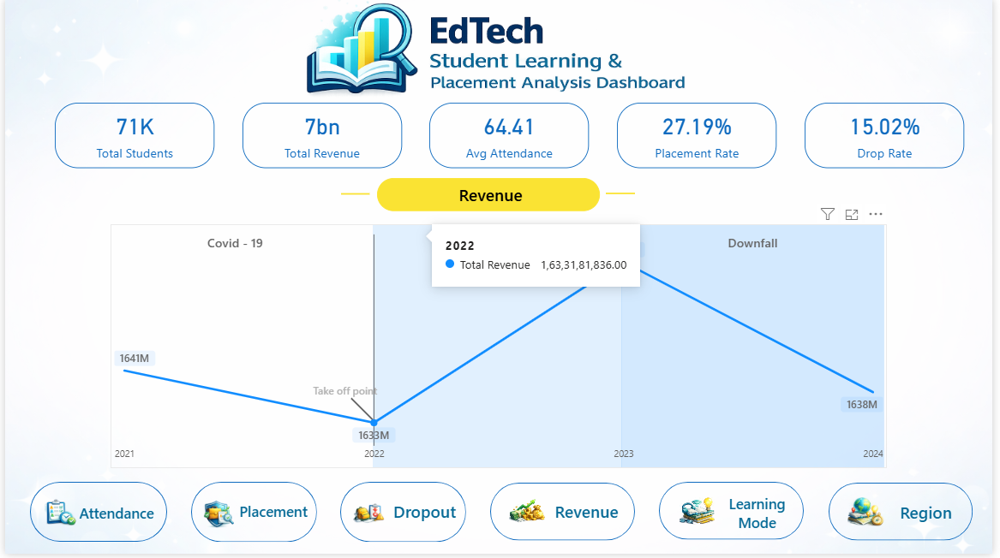
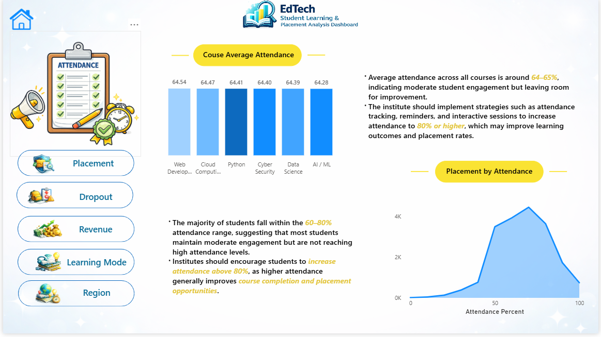
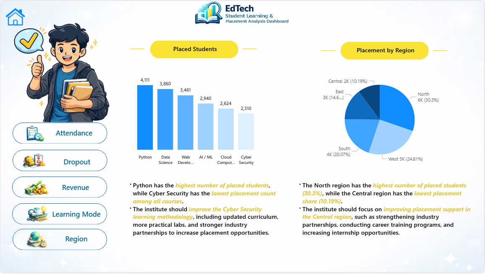
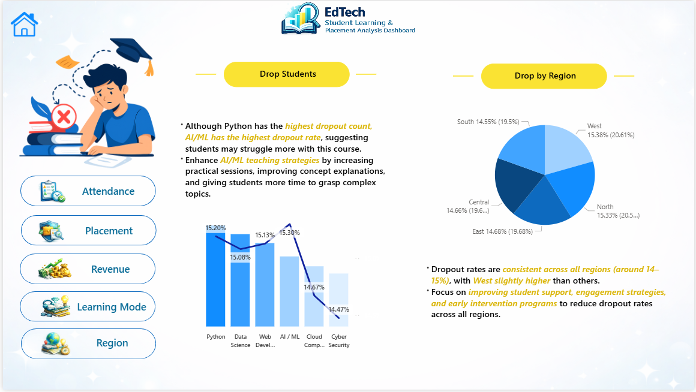
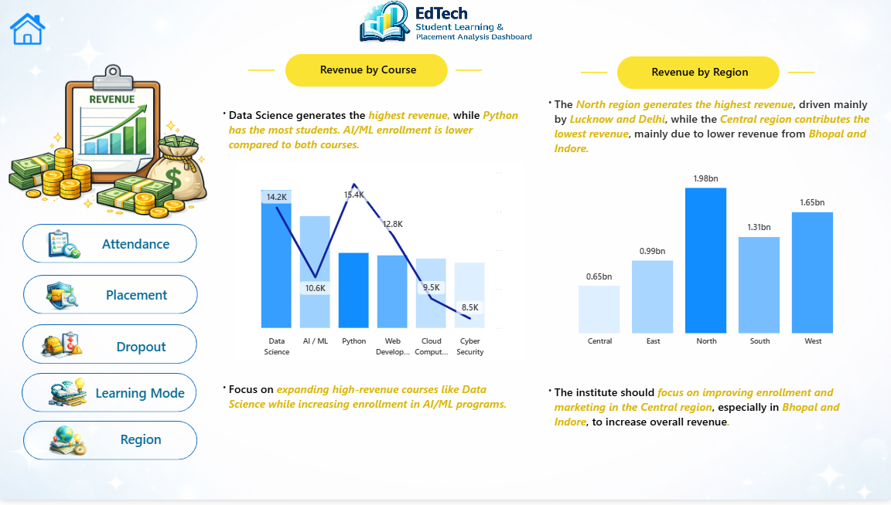
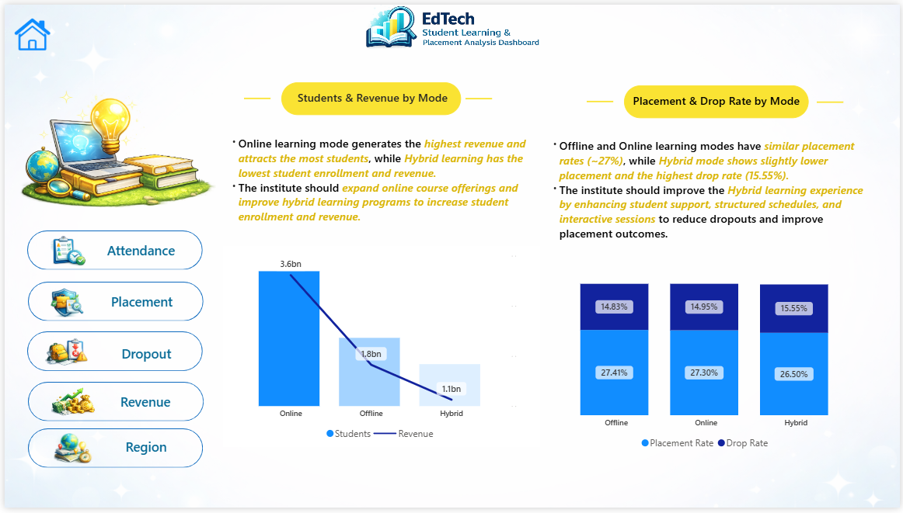
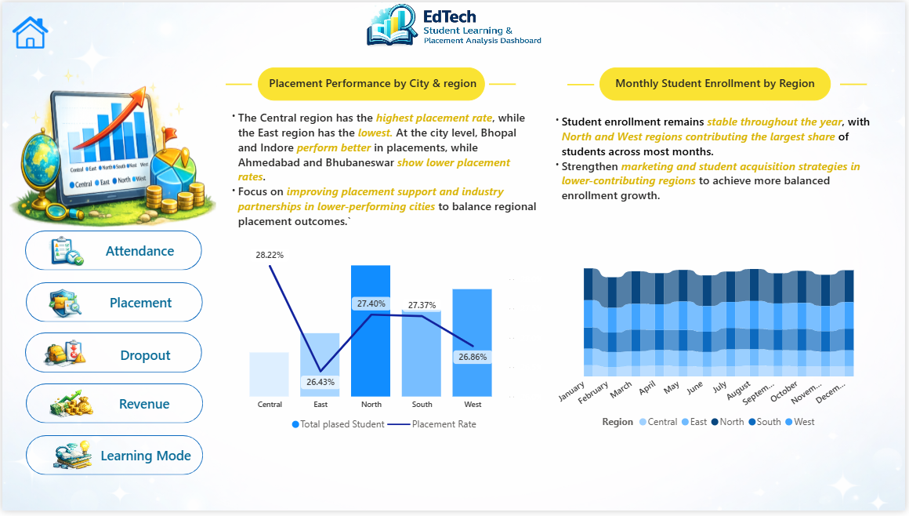

# EdTech Student Learning & Placement Analysis

## Dashboard Overview

This project analyzes **student learning performance, placements, attendance trends, revenue generation, and dropout patterns** for an EdTech platform using **Python, SQL, and Power BI**.

---

# Power BI Dashboard Pages

## 1️⃣ Main Dashboard

Shows overall metrics:

* Total Students
* Placement Rate
* Dropout Rate
* Average Attendance
* Revenue Generated

---

## 2️⃣ Attendance Analysis

Insights:

* Average attendance around **64–65%**
* Higher attendance leads to better course completion

---

## 3️⃣ Placement Analysis

Insights:

* **Python course has highest placement success**
* Placement rate varies by course

---

## 4️⃣ Dropout Analysis

Insights:

* AI/ML course shows **higher dropout rates**
* Low attendance strongly affects completion

---

## 5️⃣ Revenue Analysis

Insights:

* **Data Science courses generate highest revenue**
* Revenue depends on course popularity

---

## 6️⃣ Learning Mode Analysis

Insights:

* Most students prefer **online learning mode**
* Offline courses show slightly higher engagement

---

## 7️⃣ Regional Analysis

Insights:

* **North region shows strongest placement performance**
* Regional differences affect revenue and enrollment

---

# Tools Used

* Python (Data Cleaning)
* Pandas (Data Processing)
* MySQL (Database)
* Power BI (Dashboard Visualization)
* Git & GitHub (Version Control)

---

# Project Workflow

Raw Dataset
↓
Python Data Cleaning
↓
MySQL Database
↓
Power BI Dashboard

---

# Author

**Mayur Makvana**

BCA Student | Aspiring Data Analyst
